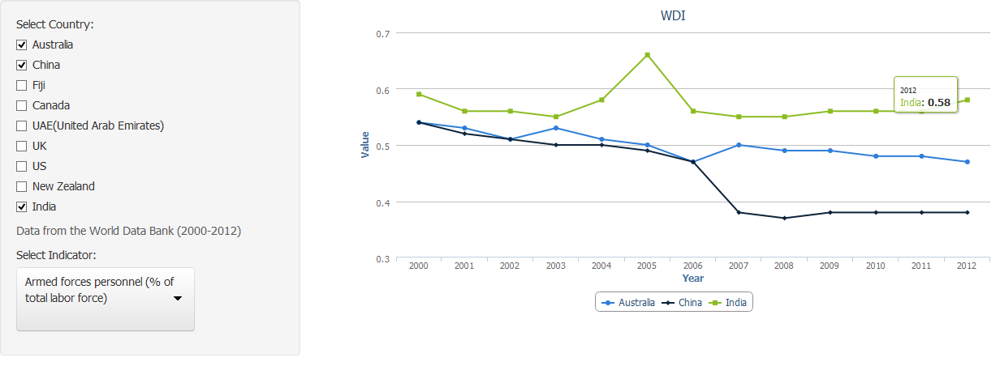

## Introduction 

This presentation has been created for the Course Project for the Coursera 
Developing Data Products class.  The following slides provide a brief overview of 
the very simple to use shiny application created for this project.  
</br>

## Data Source 
The data used for this application was sourced from the  <a href="http://www.worldbank.org/">
World Bank Group</a>'s  <a href="http://data.worldbank.org/"> Data Catalog</a>,  
which provides free and open access to data about development in countries around the globe.  
</br>

## The Application - WDI_Trends  
The shiny application that has been developed provides interactive chart that 
allows the user to view trends in various World Development Indicators for 
9 countries from 2000-2012.   


--- &twocol
## Available Data Options

<p>
The below tables show the Countries & World Development Indicators (WDI) available in 
this application.  <br />
 <font size="2">
    <sub><b> NOTE: Data for both countries and WDIs have been selected at random.
    Additional data can be found on the  <a href="http://www.worldbank.org/">
    World Bank Group</a> website.   
    </b> </sub>
</font> 
</p>
*** =left

<b>Countries</b>

```{r country, results='asis',echo =FALSE}
library(xtable)
countries <- data.frame(c("Australia",
                          "China",
                          "Fiji",
                          "Canada",
                          "UAE (United Arab Emirates)",
                          "UK",
                          "US",
                          "New Zealand",
                          "India"))
colnames(countries) <- "Countries"

print(xtable(countries),
      type = "html",
      include.rownames = FALSE,
      include.colnames = FALSE,
      #html.table.attributes="border='1' align='center' bgcolor='#FFCC00'"
      html.table.attributes ='class=mytable'
)

```

<font size="3"> 
The tables use xtable to display a unique list of values from the data source 
</font>

*** =right

<b>World Development Indicators</b>

```{r WDI, results='asis',echo =FALSE}
library(xtable)
indicators <- data.frame(c(
"Armed forces personnel (% of total labor force)",
"Armed forces personnel, total",
"Health expenditure per capita (current US$)",
"Health expenditure, total (% of GDP)",
"Life expectancy at birth, female (years)",
"Life expectancy at birth, male (years)",
"Life expectancy at birth, total (years)",
"Mortality rate, adult, female (per 1,000 female adults)",
"Mortality rate, adult, male (per 1,000 male adults)",
"Out-of-pocket health expenditure (% of private expenditure on health)",
"Out-of-pocket health expenditure (% of total expenditure on health)",
"Population ages 0-14 (% of total)",
"Population ages 15-64 (% of total)",
"Population ages 65 and above (% of total)",
"Population growth (annual %)"
))
colnames(indicators) <- "World Development Indicator"

print(xtable(indicators),
      type = "html",
      include.rownames = FALSE,
      include.colnames = FALSE,
      #html.table.attributes="border='1' align='center' bgcolor='#FFCC00'"
      html.table.attributes ='class=mytable'
)

```

<style>
  table.mytable 
  {
    border-collapse: collapse;
    width: 100%;
    font-family: 'Arial';
    line-height: 18px;  
  }
  table.mytable tr, td 
  {
    border: 2px solid black;
    font-family: 'Arial';
  }
  table.mytable tr:nth-child(2n+1) 
  {
    background:  #A9BCF5;
  }
</style>


--- .class #id
## Interactive User Options
<p>
There are two user options available in this application:
   <ol>
      <li>Country:   You can tick which countries should be displayed in the chart</li>
      <li>Indicator: You can select which World Development Indicator to view</li>
   </ol> 
</p>

<font size="4">
The below is an example if you selected to view one of the Armed forces 
trends for Australia, China & India.   
</font>




--- .class #id 
## Now What?
</br>

<p> 
   <ul type="circle">
      <li>You can access the Shiny Application <a href="https://krystal910.shinyapps.io/WDI_Trends/"> here. </a>  </li>
   </ul> 
</p>


<p> 
   <ul>
      <li>You can access the source code <a href="https://github.com/krystal910/DevDataProducts"> here. </a>  </li>
   </ul> 
</p>
</br>
</br>
</br>
</br>

<p><font color="purple"><h2 align="center"><b>Thankyou</b> </h2></font></p>

<center></center>
